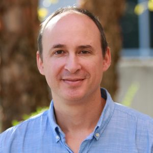

A lot of different people help make our Carpentries community at UGA.

### IOB Outreach Committee
Currently, most of the Carpentries work at UGA is carried out by the Institute of Bioinformatics Outreach Committee:

|  Jason Wallace  (Crop & Soil Science) |  Shannon Quinn  (Computer Science) |  Holly Bik  (Marine Science/IOB) |  Casey Bergman  (Genetics/IOB) |
|---|---|---|---|
| | | | |

### Badged Instructors

The following people are the known badged Carpentries instructors at UGA. If you notice someone missing, please let us know.

|Name|Department|Role|
|---|---|---|
|Bergman, Casey|Genetics, IOB|Faculty|
|Bik, Holly|Marine Sciences, IOB|Faculty|
|Vaughn, Justin|USDA|Research Scientist|
|Wallace, Jason|Crop & Soil Science|Faculty|

### Alumni
The nature of a University is that people move on. Here are some of our past community members and where they have gone since

(Note: this space intentionally saved for future information)

|Name|Department|Next Adventure|
|---|---|---|
| | | |
