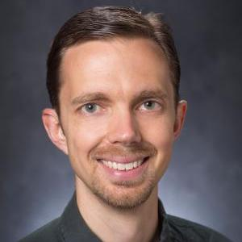
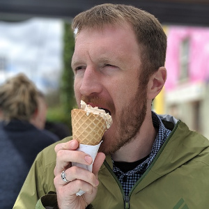
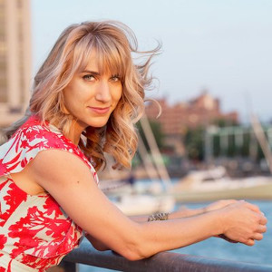

A lot of different people help make our Carpentries community at UGA.

### IOB Outreach Committee
Currently, most of the Carpentries work at UGA is carried out by the Institute of Bioinformatics Outreach Committee:

|  Jason Wallace  (Crop & Soil Science) |  Shannon Quinn  (Computer Science) |  Holly Bik  (Marine Science/IOB) |  Casey Bergman  (Genetics/IOB) |
|---|---|---|---|
| | | | |

### Badged Instructors

The following people are the known badged Carpentries instructors at UGA. If you notice someone missing, please let us know.

|Name|Department|Role|
|---|---|---|
|[Bergman, Casey](https://www.genetics.uga.edu/directory/people/casey-bergman)|Genetics, Bioinformatics|Faculty|
|[Bik, Holly](https://www.marsci.uga.edu/directory/people/holly-bik)|Marine Sciences, Bioinformatics|Faculty|
|[Corut, Kivanc](https://www.linkedin.com/in/kivanc-corut/)|Bioinformatics|Graduate Student|
|[Cohen, Natalie](https://www.marsci.uga.edu/directory/people/natalie-cohen)|Marine Sciences|Faculty|
|[De Santiago, Alejandro](https://www.linkedin.com/in/alejandrodesantiago/)|Bioinformatics|Graduate Student|
|[Francis, Michael](https://www.linkedin.com/in/michaelofrancis/)|Bioinformatics|Graduate Student|
|[Johnsen, Kyle](https://engineering.uga.edu/people/profile/kyle-johnsen-ph.d)|Engineering|Faculty|
|[Miller, Mark](https://www.linkedin.com/in/mark-miller-415b0ab7/)|Plant Breeding, Genetics, & Genomics|Graduate Student|
|[Montenegro, Tito](https://www.linkedin.com/in/tito-montenegro/)|Marine Science|Postdoc|
|[Pennetti, Vincent](https://www.linkedin.com/in/vincent-pennetti-77ba0b192/)|Plant Breeding, Genetics, & Genomics|Graduate Student|
|[Pereira, Tiago](https://www.marsci.uga.edu/directory/people/tiago-jose-pereira)|Marine Scienes, Bioinformatics|Postdoc|
|[Quinn, Shannon](https://www.cs.uga.edu/directory/people/shannon-quinn)|Computer Science|Faculty|
|[Quirk, Lucy](https://www.marsci.uga.edu/directory/people/lucy-quirk)|Marine Sciences|Graduate Student|
|[Schultz, Corey](https://www.linkedin.com/in/corey-schultz/)|Bioinformatics|PhD Student|
|[Tran, Dung ("Ivy")](https://www.linkedin.com/in/dungtran12/)|Plant Breeding, Genetics, & Genomics|Graduate Student|
|[Voghoei, Sahar ](https://cviog.uga.edu/about-us/faculty-staff/sahar-voghoei.html)|Carl Vinson Institute of Government|Staff|
|[Wallace, Jason](https://cropsoil.uga.edu/people/faculty/jason-wallace.html)|Crop & Soil Science|Faculty|
|[Wright, Hallie](https://www.linkedin.com/in/hallie-wright-102533a4/)|Plant Breeding, Genetics, & Genomics|Graduate Student|

### Alumni
The nature of a University is that people move on. Here are some of our past community members and where they have gone since

|Name|Department|Next Adventure|
|---|---|---|
|[Kovar, Lynsey](https://www.linkedin.com/in/lkovar/)|Bioinformatics|[Inari](https://inari.com/)|
|[Gimode, Davis](https://expertfinder.cgiar.org/display/ad-Gimode-Davis-ICRISAT)|Plant Breeding, Genetics, & Genomics|[ICRISAT - Kenya](https://www.icrisat.org/tag/kenya/)|
|[Soleymani, Saber](https://www.linkedin.com/in/sabersol/)|Computer Science|[GSU-Robinson College of Business](https://robinson.gsu.edu)|
|[Taitano, Nathan](https://www.linkedin.com/in/nathan-taitano-3720593a/)|Plant Breeding, Genetics, & Genomics|[BASF](https://www.basf.com/us/en.html)|
|[Vaughn, Justin](https://scholar.google.com/citations?user=Udhv0SkAAAAJ&hl=en&oi=ao)|USDA-ARS|[USDA-ARS Genomics and Bioinformatics Research Unit](https://www.ars.usda.gov/southeast-area/stoneville-ms/genomics-and-bioinformatics-research/)|

